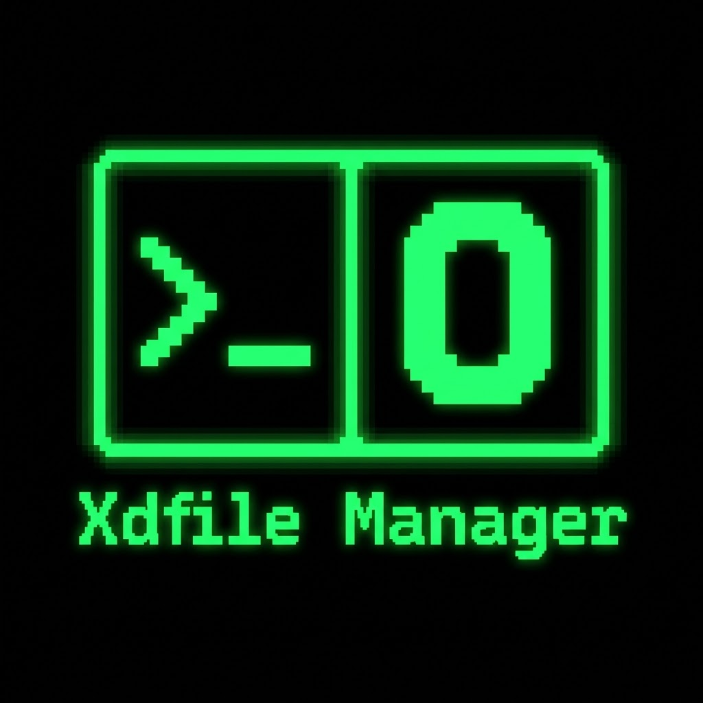

# Xdfile Manager

<p align="center">
  
</p>

<p align="center">
  现代化双面板终端文件管理器 · 键盘高效操作 · 完善鼠标支持
</p>

<p align="center">
  
  
  
</p>

---

**Xdfile Manager** 是一个功能丰富的双面板终端文件管理器，专为键盘高效操作设计，同时补齐常用鼠标交互。支持 Start Hub 连接首页、本地文件管理、内置命令行、文件预览、用户自定义菜单、内置 Persona / TOML 主题和 SSH/NetBox 远程目录访问。

> 推荐配合 [Windows Terminal](https://github.com/microsoft/terminal) 或 [iTerm2](https://github.com/gnachman/iTerm2) 使用以获得最佳体验。

## 启动

Windows：

```powershell
dist\windows-amd64\xdfile.exe
```

Linux：

```bash
chmod +x dist/linux-amd64/xdfile
dist/linux-amd64/xdfile
```

无参数启动会进入 Start Hub，可选择本地工作台或已保存 SSH 主机。直接进入双栏工作台：

```bash
xdfile --workbench
```

指定左右面板起始目录：

```powershell
xdfile.exe C:\work D:\data
```

```bash
./xdfile ~/work ~/data
```

查看配置路径：

```powershell
xdfile.exe path-list
```

## 参数

| 参数 | 功能 |
|---|---|
| `-c, --config-file` | 指定配置文件 |
| `-hf, --hotkey-file` | 指定快捷键文件 |
| `-cf, --chooser-file` | 输出打开路径 |
| `-pld, --print-last-dir` | 输出最后目录 |
| `-fh, --fix-hotkeys` | 补齐快捷键 |
| `-fch, --fix-config-file` | 补齐主配置 |
| `--workbench` | 跳过 Start Hub，直接进入双栏工作台 |

## 界面

| 区域 | 功能 |
|---|---|
| 顶部 | 主菜单、路径、状态 |
| 左右面板 | 文件列表 |
| 底部终端 | 命令输入和输出 |
| 底栏 | 当前选择、面板、排序和状态信息 |

Start Hub 是启动连接页，左侧包含 `Local`、`Hosts`、`Recent`、`Settings`。`Enter` 或双击打开，`/` 搜索 SSH 主机，`n` 新建连接，`e` 编辑，`d` 删除，`l` 进入本地工作台。

状态符号：

| 状态 | 符号 |
|---|---|
| 完成 | `✓` |
| 失败 | `!` |
| 等待 / 冲突处理 | `?` |
| 取消 | `×` |
| 普通状态 | `●` |
| 执行中 | `⠋ ⠙ ⠹ ⠸ ⠼ ⠴ ⠦ ⠧ ⠇ ⠏` 循环显示 |

## 基础操作

| 快捷键 / 操作 | 功能 |
|---|---|
| `Tab / Shift+Tab` | 切换左右面板焦点 |
| `Enter` | 进入目录或打开文件 |
| `Up / Down` | 移动文件光标 |
| `Left / Right` | 按页移动文件光标 |
| `PgUp / PgDn` | 翻页 |
| `Home / End` | 跳到首项 / 末项 |
| `Esc` | 清除选择或关闭当前弹窗 |
| `R` | 刷新 |
| `F1` | 帮助 |
| `F9` | 显示 / 隐藏隐藏文件 |
| `F10` | 退出 |
| `Ctrl+Left / Ctrl+Right` | 调整左右面板宽度 |
| `Ctrl+Up / Ctrl+Down` | 调整终端高度 |
| `Ctrl+T` | 新建工作区标签 |
| `Ctrl+W` | 关闭当前工作区标签，底部终端输入框聚焦时保留文本编辑语义 |
| `Ctrl+] / Ctrl+[` | 切换下一个 / 上一个工作区标签 |
| `Ctrl+3` | 按名称排序 |
| `Ctrl+4 / Ctrl+\` | 按扩展名排序 |
| `/` | 过滤当前面板文件名，`Esc` 退出并恢复进入过滤前的光标 |
| `Ctrl+F` | 模糊搜索当前面板，`Enter` 跳转到候选项，`Esc` 恢复 |

## 工作区标签

`View -> New tab` 会创建一个新的 workspace tab。每个 tab 保留自己的双栏面板路径、活动面板、底部终端 cwd、过滤 / 搜索状态和 Quick View 状态；主题、配置、NetBox 连接、Pin、User Menu 和插件列表是全局共享的。

`View -> Close tab` 会关闭当前 tab；关闭最后一个 tab 时不会退出程序，而是重置为一个空的单 tab。`View -> Next tab` 和 `View -> Previous tab` 用于切换。`Options -> Save setup` 会保存 tab 的左右路径和当前 tab 序号，旧 layout 没有 tab 字段时仍按单 tab 启动。

当终端正在运行命令、PTY shell 接管输入、独占 TUI 活跃或后台文件操作进行中时，tab 切换会被拒绝以避免 cwd 和面板状态在任务中途被替换。

## Keymap

`Options -> Keymap` 可在默认键位和 Vim preset 之间切换；`Options -> Save setup` 会保存当前 keymap。

Vim preset 当前只接通基础文件面板动作：

| Vim 键位 | 功能 |
|---|---|
| `j / k` | 移动文件光标 |
| `J / K` | 选择并向下 / 向上移动 |
| `-` | 返回父目录 |
| `Enter` | 进入目录或打开文件 |
| `a / r / d` | 新建目录 / 重命名 / 删除 |
| `y / x / p` | 复制 / 剪切 / 粘贴文件剪贴板项 |
| `. / ?` | 显示隐藏文件 / 帮助 |
| `Y / c / P` | 复制当前路径 / 复制当前目录 / 打开 Pins |
| `z` | 打开 Zoxide jump |
| `Ctrl+A / Ctrl+E` | 打包 / 解压 |

## 鼠标

| 操作 | 功能 |
|---|---|
| 左键单击 | 聚焦面板并选择文件 |
| 双击 | 进入目录或打开文件 |
| 右键 | 打开与面板样式一致的 TUI 右键菜单 |
| `Ctrl + 左键` | 切换单项多选 |
| `Shift + 左键` | 范围选择，取决于终端是否传递 Shift 鼠标事件 |
| `Alt + 左键` | 范围选择，作为 Windows Terminal 中 Shift 冲突的替代方式 |
| 拖动 | 范围拖选 |
| 滚轮 | 滚动鼠标所在面板，不移动文件光标 |

Windows 本地文件的 TUI 右键菜单中有 `Windows menu` 项，调用 Windows Shell 原生右键菜单。

## 文件操作

| 快捷键 / 操作 | 功能 |
|---|---|
| `Ctrl+Shift+C` | 复制选中文件到系统剪贴板 |
| `Ctrl+X` | 剪切选中文件到系统剪贴板 |
| `Ctrl+Shift+V` | 粘贴 |
| `Panels -> Copy current path` | 复制当前文件路径为纯文本 |
| `Panels -> Copy selected paths` | 复制选中路径列表为纯文本，使用换行分隔 |
| `Panels -> Copy directory path` | 复制当前目录为纯文本 |
| `Panels -> Pins` | 打开 Home 和已保存 Pin 的快速跳转弹层 |
| `Panels -> Add pin` | 将当前目录保存为 Pin，可重命名或删除 |
| `Panels -> Zoxide jump` | 查询 zoxide 候选目录并跳转当前面板 |
| `Panels -> Pack archive` | 将当前文件或选中项打包为 `.zip` 或 `.tar.gz` |
| `Panels -> Extract archive` | 将本地 `.zip` 或 `.tar.gz` 安全解压到文件夹 |
| `Panels -> Batch rename` | 使用模板批量重命名本地选中项，执行前显示预览 |
| `Panels -> MD5 checksum` | 按需计算当前本地文件的 MD5，并在结果窗口中复制 |
| `F4` | 重命名 |
| `F5` | 复制到另一面板 |
| `F6` | 移动到另一面板 |
| `F7` | 新建目录 |
| `F8` | 删除 |
| `Ctrl+Z` | 撤回最近一次删除或面板内剪切移动 |
| `Ctrl+C` | 取消正在执行的文件操作 |

归档创建和解压都只支持本地 `.zip` / `.tar.gz`。目标同名时可选择 `Replace`、`Skip` 或 `Keep both`；解压会拒绝路径穿越、绝对路径、symlink、hardlink 和特殊文件条目。

批量重命名只支持本地文件和目录。模板支持 `{base}`、`{ext}`、`{name}`、`{index}`；在预览窗口按 `Enter` 才会写盘，`Esc` 会取消且不改文件。目标为空、包含路径分隔符、与现有文件冲突、批内重复或大小写策略下冲突都会被阻止。

MD5 只在用户主动触发时计算，不会在默认文件列表中扫描。大文件计算时可用 `Ctrl+C` 取消；结果窗口按 `c` 可复制 checksum。远程文件和目录不支持 MD5，需先复制到本地文件。

## 粘贴冲突

| 选项 | 功能 |
|---|---|
| `Replace` | 覆盖 |
| `Skip` | 跳过 |
| `Keep both` | 保留两份 |
| `Apply all` | 后续冲突使用同一策略 |

Linux 文件剪贴板需要 `wl-clipboard`、`xclip` 或 `xsel`。

纯文本路径复制只写入文本剪贴板；远程路径会保留 `xdssh://连接名/路径` 形式，不改变内部文件剪贴板的复制/剪切状态。

Pin 列表会持久化保存用户添加的目录；Home 是固定快速入口，不写入 Pin 文件。

Zoxide 跳转需要系统已安装 `zoxide`，并在 `xdfile-config.toml` 中启用 `zoxide_support = true`。未安装时会安静降级，不会修改 shell 配置；该功能只切换本地面板目录。

## 多选

| 快捷键 / 操作 | 功能 |
|---|---|
| `Shift+Up / Shift+Down` | 多选 |
| `Shift+Left / Shift+Right` | 按页范围选择；已全选的范围再次操作会取消 |
| `Ctrl + 左键` | 切换单项选择 |
| `Shift / Alt + 左键` | 范围选择 |
| 鼠标拖动 | 范围拖选 |
| `Esc` | 清除选择 |

## 快速搜索

| 快捷键 | 功能 |
|---|---|
| `Alt+字符` | 开始搜索 |
| 继续输入 | 继续匹配 |
| `Backspace` | 删除搜索字符 |
| `Enter` | 打开匹配项 |
| `Ctrl+N / Ctrl+P` | 下一个 / 上一个匹配 |
| `Esc / F10` | 关闭搜索 |

支持 `*` 和 `?` 通配符。

## 文件过滤

| 快捷键 / 操作 | 功能 |
|---|---|
| `/` | 打开当前面板过滤输入 |
| 输入文本 | 按文件名子串过滤，大小写不敏感 |
| `Up / Down / PgUp / PgDn` | 在过滤结果中移动 |
| `Backspace / Ctrl+U` | 删除字符 / 清空过滤 |
| `Enter` | 打开当前过滤结果 |
| `Esc` | 退出过滤并恢复进入过滤前的光标位置 |

过滤只改变当前面板的可见列表，不改变目录扫描、排序或真实多选状态。

## 模糊搜索

| 快捷键 / 操作 | 功能 |
|---|---|
| `Ctrl+F` | 打开当前面板模糊搜索 |
| 输入文本 | 按文件名子序列匹配，连续匹配和单词边界优先 |
| `Up / Down / PgUp / PgDn` | 选择候选项 |
| `Backspace / Ctrl+U` | 删除字符 / 清空查询 |
| `Enter` | 跳转到当前候选项，不直接打开文件或目录 |
| `Esc` | 退出并恢复进入搜索前的光标位置 |

模糊搜索只在当前目录的现有列表中定位文件，不做全盘索引，也不改变文件过滤状态。

## 预览

| 快捷键 / 操作 | 功能 |
|---|---|
| `F3` | 预览当前文件 |
| `Ctrl+Q` | 切换 Quick View |
| `Ctrl+B` | 在预览中切换二进制视图 |
| 滚轮 / `PgUp / PgDn` | 滚动预览内容 |

## 命令行

| 快捷键 / 操作 | 功能 |
|---|---|
| `Enter` | 执行命令 |
| `PgUp / PgDn` | 滚动输出 |
| `Ctrl+O` | 展开终端 |
| `Terminal -> AI command` | 生成命令草稿并回填输入框，不自动执行 |
| `Terminal -> Command history` | 查看完整命令历史，`Enter` / `p` 回填输入框，`c` 复制命令 |
| 鼠标点击输入行 | 移动输入光标 |
| `Up / Down` | 选择预测 |
| `Right` | 接受预测 |
| `Delete` | 删除选中的历史预测命令 |
| `Ctrl+R` | 反查历史命令，输入子串过滤，`Enter` 回填但不执行 |
| `Esc` | 关闭预测 |

命令历史保存在 `xdfile-terminal-history.json`。`Up / Down` 和 `Ctrl+R` 面向去重后的预测 / 反查；`Terminal -> Command history` 展示执行日志，重复执行的命令也会保留。回填历史命令只写入底部终端输入框，不会自动执行。

提示符：

| 提示符 | 功能 |
|---|---|
| `XD>` | 本地命令 |
| `user@连接名>` | 远程命令 |

内置命令包括 `ls`、`ll`、`la`、`cat`、`clear`、`cls`。交互式 TUI 程序会进入独占终端模式，例如 `vim`、`nvim`、`less`、`fzf`、`lazygit`、`yazi`；`vim --version`、`nvim --headless` 这类非交互调用会留在普通命令流。

### AI 命令草稿

`Terminal -> AI command` 会打开自然语言输入框，生成结果只会填入底部终端输入框，不会自动按 Enter。删除、覆盖、权限变更、网络上传、包管理、远程执行等危险命令会先显示确认；确认后仍只是回填草稿。

AI 默认关闭。当前运行时只发送用户请求、当前 cwd 和选中路径摘要，不读取文件内容，不保存 API key，不做自主文件操作。API key 只能通过 `ai_api_key_env` 指定的环境变量读取；默认构建只包含 `local` / `template` provider，用于少量本地命令模板和测试接入。

### 终端 cwd 同步

Xdfile 会监听本地 PTY 输出中的 OSC 7 working directory 事件，并在收到有效本地目录时同步底部终端 cwd 和当前活动面板。普通 shell 或独占 TUI 程序没有输出 OSC 7 时，Xdfile 会保留原目录；该机制不覆盖远程 NetBox 命令，也不保证任意子进程退出后都能同步 cwd。

Xdfile 不会自动修改 `.bashrc`、`.zshrc` 或 PowerShell profile。不发 OSC 7 的 shell 可以手动加入下面的 opt-in hook。

Bash：

```bash
__xdfile_emit_osc7() {
  local uri
  uri="$(python3 - <<'PY'
import os
import urllib.parse
print("file://localhost" + urllib.parse.quote(os.getcwd()))
PY
)"
  printf '\033]7;%s\033\\' "$uri"
}

PROMPT_COMMAND="__xdfile_emit_osc7${PROMPT_COMMAND:+;$PROMPT_COMMAND}"
```

Zsh：

```zsh
__xdfile_emit_osc7() {
  local uri
  uri="$(python3 - <<'PY'
import os
import urllib.parse
print("file://localhost" + urllib.parse.quote(os.getcwd()))
PY
)"
  printf '\033]7;%s\033\\' "$uri"
}

precmd_functions+=(__xdfile_emit_osc7)
```

PowerShell：

```powershell
function prompt {
  $builder = [System.UriBuilder]::new()
  $builder.Scheme = "file"
  $builder.Host = "localhost"
  $builder.Path = (Get-Location).Path
  [Console]::Write("$([char]27)]7;$($builder.Uri.AbsoluteUri)$([char]27)\")
  "PS $PWD> "
}
```

## 菜单

| 菜单 | 功能 |
|---|---|
| `Panels` | 面板操作 |
| `View` | 显示和排序 |
| `Terminal` | 终端 |
| `Plugins` | 外部命令插件 |
| `NetBox` | SSH |
| `Theme` | 主题 |
| `Options` | 设置 |

## F2 用户菜单

| 快捷键 | 功能 |
|---|---|
| `F2` | 打开 User Menu |
| `Enter` | 执行或打开子菜单 |
| `Ins` | 新增命令或子菜单 |
| `F4` | 编辑当前项 |
| `Del` | 删除当前项 |
| `Esc` | 返回 |
| `Left / Right` | 切换层级 |

常用 metasymbol：

| 符号 | 功能 |
|---|---|
| `!.!` | 当前文件 |
| `!&` | 选中文件 |
| `!@!` | 选中文件列表 |
| `!?提示?默认值?` | 输入参数 |
| `!# / !^` | 另一面板 |

## 插件

插件 v1 使用外部命令协议，不加载 Go dynamic plugin，也不开放内部 Go API。插件目录位于 `xdfile-data/plugins/`；每个插件目录放置 `xdfile-plugin.json`，并且只有显式写入 `enabled: true` 的插件才会出现在 `Plugins` 菜单。

最小 manifest：

```json
{
  "name": "Example",
  "version": "0.1.0",
  "command": "./example-plugin",
  "capabilities": ["show_text", "terminal_command", "copy_text"],
  "timeout_ms": 2000,
  "enabled": true
}
```

Xdfile 会通过 JSON stdin 传入当前 cwd 和选中路径摘要。插件 stdout 只能返回三类动作：显示文本、填入终端命令草稿、复制文本。插件不能直接删除、移动、上传文件或修改 Xdfile 配置；无效 JSON、非零退出码、超时和不存在的命令都会显示为错误，不应影响主 TUI。

## SSH / NetBox

新建连接：

```text
NetBox -> Connection Hub
```

| 字段 | 功能 |
|---|---|
| `Name` | 连接名 |
| `Host` | 主机地址 |
| `Port` | 端口 |
| `User` | 用户 |
| `Password` | 密码 |
| `Save password` | 加密保存密码 |

保存密码时，`xdfile-netbox.json` 只写入 `enc:v1:` 密文；本机加密密钥保存在 `xdfile-netbox.key`，文件权限为仅当前用户读写。旧版本保存过的明文密码会在下次加载时自动迁移为密文。更推荐使用 SSH key 或 ssh-agent。

无保存密码时，交互式 SSH 终端优先使用系统 `ssh`，保留 ssh-agent、identity file、jump host 和系统 `known_hosts` 行为。保存密码时，Xdfile 使用 Go SSH 客户端并要求主机已经存在于 `~/.ssh/known_hosts`，不会静默信任未知主机。

远程操作：

| 操作 | 功能 |
|---|---|
| Start Hub 中打开连接 | 进入远程 workspace |
| 底部终端 | 启动完整交互式 SSH shell |
| `cd` | 在远程 shell 中切换目录；同一 profile 面板切目录会尝试同步终端 cwd |
| `Ctrl+Shift+C` | 复制远程文件 |
| `Ctrl+Shift+V` | 粘贴到远程目录 |
| `F5` | 本地 / 远程面板间复制 |
| `F7` | 新建远程目录 |
| `F4` | 远程重命名 |
| `R` | 刷新远程目录 |

远程限制：

- 远程复制 / 粘贴需要远端有 `tar`。
- 远程粘贴只支持复制，不支持剪切。
- 暂不支持远程撤回、剪切、预览和属性。
- `F5` 支持本地与远程之间复制；`F6` 跨端移动暂不支持。
- 批量重命名暂不支持远程目录。

## 主题

主题菜单：`Theme`

内置 Persona 主题：

- Persona 3
- Persona 3 Reload
- Persona 3 Kotone
- Persona 4
- Persona 5

`Theme` 菜单还会列出 `xdfile-theme/` 中的 TOML 主题资产。TOML 主题会映射到当前 TUI 的颜色 token，并对空值、非法颜色和关键低对比组合使用安全 fallback。`xdfile-config.toml` 的 `theme` 可填写 Persona 名称或 TOML 文件名去掉 `.toml` 后的名称，例如 `gruvbox`、`catppuccin-mocha`。

## 保存设置

| 操作 | 功能 |
|---|---|
| `Options -> Save setup` | 保存设置 |
| `Options -> Reset setup` | 重置布局、主题、视图选项和用户菜单 |
| `Options -> Keymap` | 切换 Default / Vim preset |

## 数据目录

程序数据位于可执行文件同目录的 `xdfile-data`。

| 文件 / 目录 | 功能 |
|---|---|
| `xdfile-config.toml` | 主配置 |
| `xdfile-hotkeys.toml` | 快捷键 |
| `xdfile-layout.json` | 布局 |
| `xdfile-commands.json` | User Menu |
| `xdfile-terminal-history.json` | 终端命令历史 |
| `xdfile-netbox.json` | SSH |
| `xdfile-netbox.key` | NetBox 密码本地加密密钥 |
| `xdfile-pinned.json` | Pin 快速跳转 |
| `plugins/` | 外部命令插件 |
| `xdfile.log` | 日志 |
| `xdfile-lastdir` | 最后目录 |
| `xdfile-theme/` | TOML 主题资产 |
| `cache/` | 缓存 |

当前运行时只读取 `xdfile-config.toml` 中这些稳定字段：`theme`、`default_directory`、`default_open_file_preview`、`show_image_preview`、`enable_file_preview_border`、`nerdfont`、`zoxide_support`、`ai_enabled`、`ai_provider`、`ai_model`、`ai_api_key_env`。布局、最终主题选择、用户菜单等运行时偏好仍主要保存在 JSON 状态文件里；其他 TOML 字段保留为 legacy/reserved，暂不视为已接通功能。

## 构建

本地一键构建脚本会先执行 `go test ./...` 和 `go vet ./...`，再构建 Linux amd64、Windows amd64、Darwin amd64/arm64：

```bash
./scripts/build.sh
```

```powershell
.\scripts\build.ps1
```

Release workflow 在 `v*` tag push 或手动输入 `tag_name` 时发布；CI 会先跑 `go test ./...` 和 `go vet ./...`，再构建 Linux、Windows、Darwin 的 release 矩阵产物。

Windows：

```powershell
go test ./...
go vet ./...
go build -o dist\windows-amd64\xdfile.exe .
Copy-Item README.md dist\windows-amd64\README.md -Force
```

Linux：

```bash
go test ./...
go vet ./...
go build -o dist/linux-amd64/xdfile .
cp README.md dist/linux-amd64/README.md
chmod +x dist/linux-amd64/xdfile
```

Windows 交叉构建 Linux：

```powershell
$env:GOOS='linux'
$env:GOARCH='amd64'
go build -o dist\linux-amd64\xdfile .
Copy-Item README.md dist\linux-amd64\README.md -Force
Remove-Item Env:\GOOS
Remove-Item Env:\GOARCH
```

## 许可

AGPL-3.0 license

Copyright (c) 2026 s0x401
